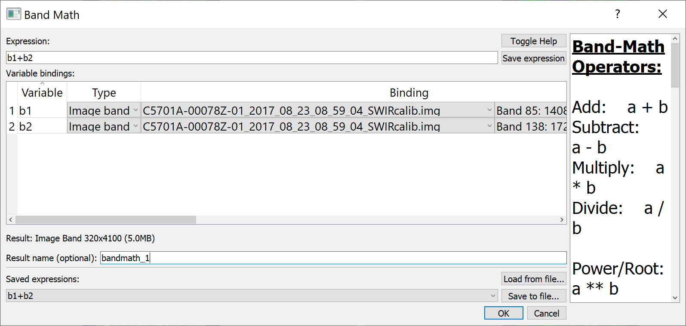

# Band Math

The band math utility is available in the Tools menu. WISER band math supports
the following operations: arithmetic, power/root, and comparisons/conditionals.
Expressions can be saved for future use, and band math can be extended with
user-defined functions in plugins. Variables can be mapped to full images,
single bands, and spectra. Help can be toggled to see the band math operators.

> Note: Band math is not currently optimized to operate on very large images
> and may exceed the memory availability of the user's computer. The expected
> size of the output is calculated to help users assess whether band math
> operations are feasible given the image size and computing resources.
