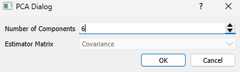
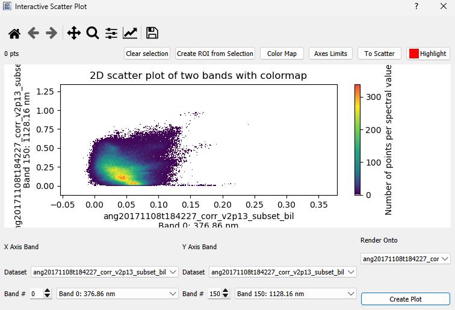

# Analytic Tools

## Continuum Removal

WISER has continuum removal built into it. To use simply right click on an image in the main image view and
press _Continuum Removal: Image_

You can use it on an individual spectrum or all collected spectra by right-clicking in the Spectrum Plot and
clicking either _Continuum Removal: Single Spectrum_ or _Continuum Removal: Collected Spectra_.

## Principle Component Analysis (PCA)

To use PCA, simply right click on an image in the main view, select PCA in the context menu, and then select
the number of principle components that you want. Currently, we only support PCA using the covariance matrix.

After PCA runs, a window will pop up that displays all of the data about how the PCA ran, including the mean,
variances, components and more. This data can be saved to a file.

## Interactive Scatter Plot

To use the interactive scatter plot you can either go to _Tools --> Data Analysis --> Interactive Scatter Plot_
or right-click on the main window when a dataset is showing and go to _Data Analysis --> Interactive Scatter Plot_.

This will pop up:

Then select the band you want to show in the x-axis and the band you want to show in the y-axis. Lastly, select
the dataset you want to render onto. When you select a polygon around points on the plot, the locations of those
will be drawn onto whatever dataset you choose to render onto.

Next press plot. A loading screen will show up. Once it is done loading you will get something that looks like this:

You can click on the plot to create a polygon as long as you're not panning or zooming. Once the polygon is made, the
pixels that correspond to the points inside that polygon will get a red circle in their center.

## Spectral Angle Mapper & Spectral Feature Fitting

These algorithms are set up very similarly in the UI, so they are grouped together in this section. The basic premise
is below:
1. There is either a target image or target spectrum and you have one or more reference spectra that you want
to compare to the target image/spectrum.
2. When you compare a target image to a reference spectrum, each spectrum in that image is compared to the reference
spectrum individually.
3. You compare the target to the references over a specific wavelength range. 
    1. In the spectral angle mapper algorithm, the angle between the two spectra is taken. 
    2. In the spectral feature fitting algorith, the root mean squared error between the two spectra
    is taken after the spectra have been scaled by a factor gamma. Gamma satisfies the least squares
    solution for sum of the squared residuals between the two spectra.

To use go to _Tools --> Data Analysis --> (Spectral Angle Mapper / Spectral Feature Fitting)_
or right-click on the main window when a dataset is showing and go to
_Data Analysis --> (Spectral Angle Mapper / Spectral Feature Fitting)_.