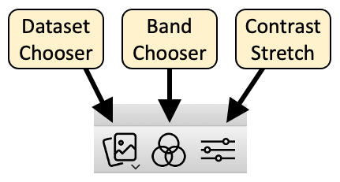
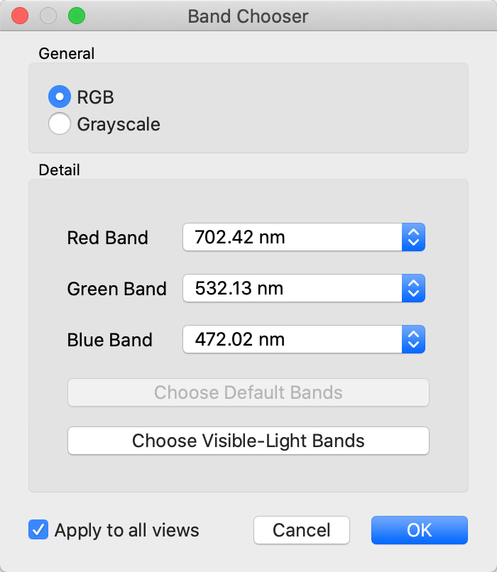
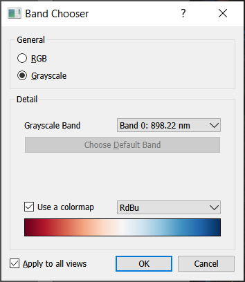

# Dataset Tools

The dataset toolbar buttons provide useful operations to switch between
datasets, change what bands are being displayed, and to adjust the contrast
stretch of the bands being displayed. Note that all raster display windows
have one or more of these buttons, allowing for control of how raster data
is displayed.

## Dataset Chooser

The _dataset chooser_ simply allows the user to change what data set is being
displayed in a given pane. When clicked, the dataset chooser will show a
pop-up menu listing all data sets currently loaded, and selecting a different
data set will switch the display to that data set.

## Band Chooser

The _band chooser_ shows a dialog that gives the user significant control over
what bands are being displayed, and whether the image is to be shown in RGB
mode (three bands) or grayscale mode (one band only).

When the grayscale or single band option is selected in the Band Chooser, WISER
can display with a color bar or gradient.

Besides letting the user select any combination of bands, the band chooser also
exposes the ability to select the dataset's default bands, if any were
indicated in the original data file. Finally, if the dataset specifies
wavelengths or frequencies for each band, and if these wavelengths are near the
red/green/blue frequencies specified in WISER's global configuration, the band
chooser can automatically choose the bands closest to these frequencies.

Note that if a data set does not have default display bands, or if the data
set doesn't have visible-light frequencies, the corresponding button in the
dialog will be disabled.
