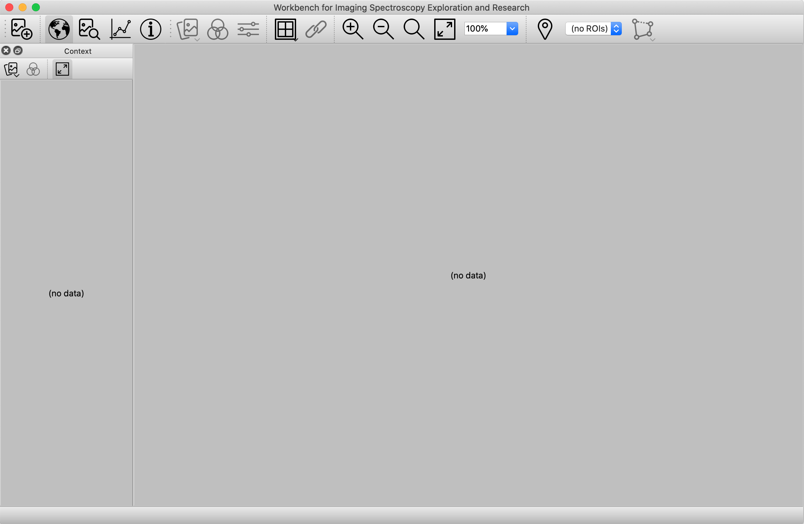
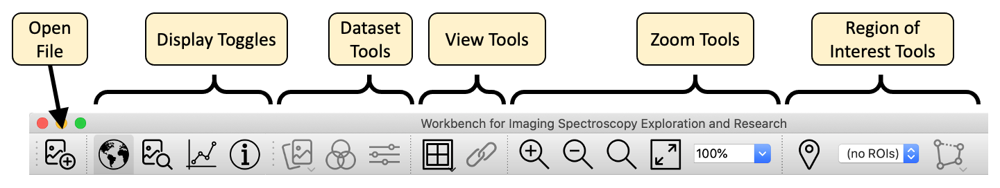
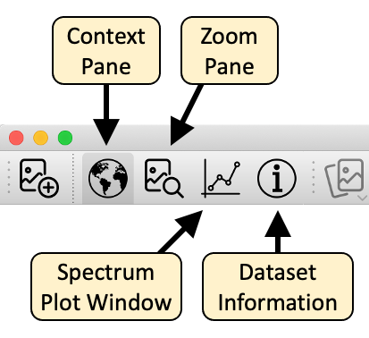
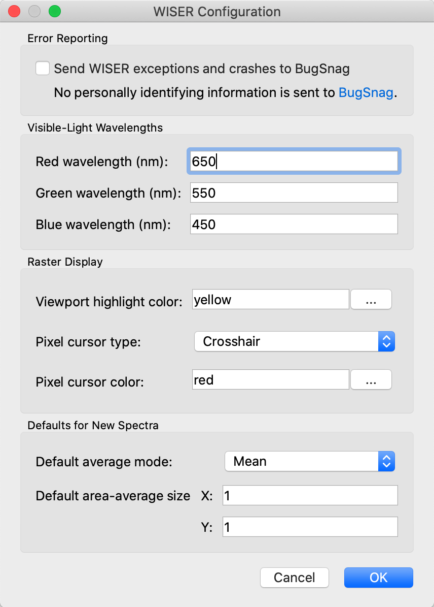
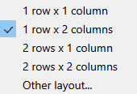
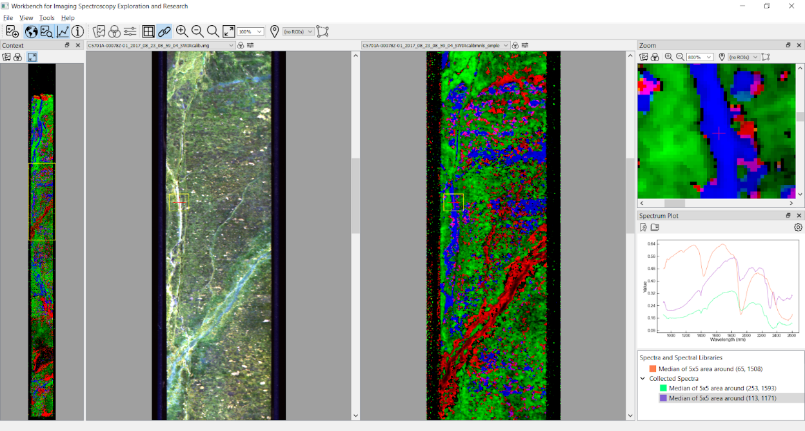

# Interface Overview

## WISER Overview

The goal of WISER is to provide an intuitive and configurable user interface
that supports many different workflows and styles of interaction. When WISER
is started, the UI looks like this:

The WISER interface provides multiple panes for displaying raster data at
varying levels of magnification. The Context Pane starts out on the left side
of the UI, and shows the raster data "scaled out," so that either one or both
dimensions are fully visible within the pane. The primary viewing area is
called the Main Window, providing more detailed interactions with raster data,
possibly scaled up to as much as 1600%. In the above screenshot, no raster
data is loaded yet, so these areas display "(no data)".

Across the top of the Main Window is the Main Toolbar, which provides various
tools to work with raster data:

The buttons marked "Display Toggles" will show and hide specific tools for
interacting with spectral data. These buttons are as follows:

These tools are described in subsequent sections.

**NOTE:** WISER can also be extended with custom functionality through its
plugin API — see the [Extending WISER](../extending-wiser/index) section of
this documentation.

## WISER Configuration

WISER provides a configuration panel for specifying common configuration across
the various tools. You can access these properties through the WISER menubar.
For example, on macOS you can access "WISER" -> "Preferences" to show this
dialog:

These settings are saved on disk so that they don't need to be specified every
time. Some additional details are given in the following sections.

### WISER Crash and Error Reporting

WISER is capable of sending crash reports to an online service called
[BugSnag](https://www.bugsnag.com). This option is **off** by default, but
it is very helpful if you turn this feature on so that application errors and
crashes can be identified and addressed automatically. No personally
identifying information is sent to BugSnag, but some users may still not want
to leave such a feature on.

### Wavelengths for Red/Green/Blue Colors

For spectral data sets that include visible-light frequencies, WISER is able to
automatically choose "true-color" bands that are close to the frequencies of
red, green and blue light. However, different data sets and instruments may
require tweaking of what is considered "red", "green" or "blue". Thus, WISER
allows the user to configure these values.

---

## Viewing an Image

Here is a screenshot of WISER after loading AVIRIS data of the Caltech campus
and the surrounding Pasadena area.

In this image, all of the different tools have been shown using the display
toggle buttons in the main toolbar:  the context pane, the main window and the
zoom pane, as well as the spectral plot window and the dataset information
window.
All of these components are dockable, and can be moved or resized within the
WISER user interface. They can also be undocked from the UI, so that they
appear as separate windows. Arrange WISER's user interface however you like it
best!
As the snapshot indicates, the area visible in the zoom pane is indicated in the
main window. Correspondingly, the area visible in the main window is indicated
in the context window.  _(Tip:  The color of this viewport highlight can be
changed in the WISER configuration dialog.)_  Mouse-clicks or scrolling within
the various display windows will update the other windows.
Mouse clicks within the main or zoom windows will update the spectrum plot window
with the pixel's spectrum.

---

## Dataset Tools

The dataset toolbar buttons provide useful operations to switch between
datasets, change what bands are being displayed, and to adjust the contrast
stretch of the bands being displayed. Note that all raster display windows
have one or more of these buttons, allowing for control of how raster data
is displayed.

## Dataset Chooser

The _dataset chooser_ simply allows the user to change what data set is being
displayed in a given pane. When clicked, the dataset chooser will show a
pop-up menu listing all data sets currently loaded, and selecting a different
data set will switch the display to that data set.

## Band Chooser

The _band chooser_ shows a dialog that gives the user significant control over
what bands are being displayed, and whether the image is to be shown in RGB
mode (three bands) or grayscale mode (one band only).

When the grayscale or single band option is selected in the Band Chooser, WISER
can display with a color bar or gradient.

Besides letting the user select any combination of bands, the band chooser also
exposes the ability to select the dataset's default bands, if any were
indicated in the original data file. Finally, if the dataset specifies
wavelengths or frequencies for each band, and if these wavelengths are near the
red/green/blue frequencies specified in WISER's global configuration, the band
chooser can automatically choose the bands closest to these frequencies.

Note that if a data set does not have default display bands, or if the data
set doesn't have visible-light frequencies, the corresponding button in the
dialog will be disabled.

---

## Grid View and Image Linking

WISER allows simultaneous viewing of multiple images in the main window through
the grid view, and images of the same size can be linked. Any grid dimensions
can be input. Click the grid icon to split or unsplit the main view.

Note that, once images are displayed in a grid, the band selector and contrast
stretch options are available above each image and not in the main WISER
toolbar.

Images in the grid can only be linked if all images open in WISER have the same
spatial dimensions.
