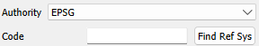
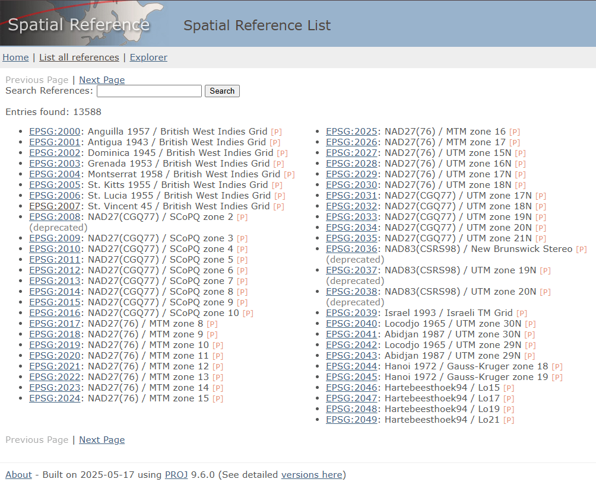
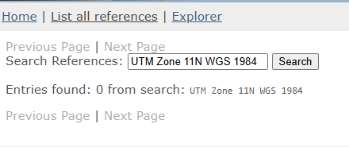
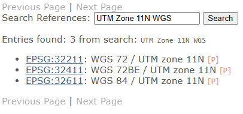
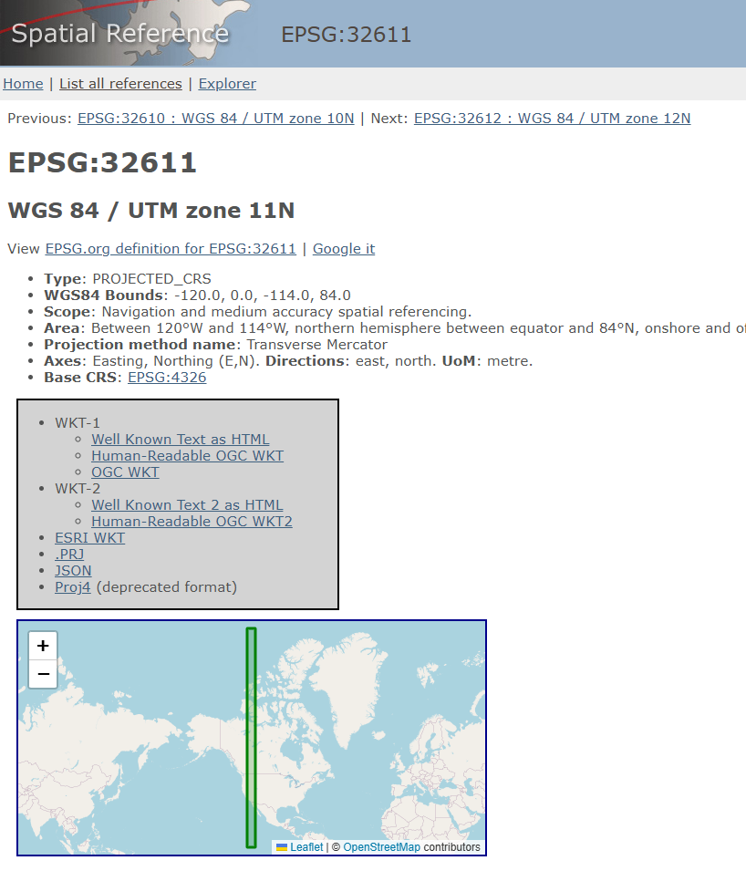
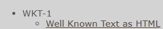
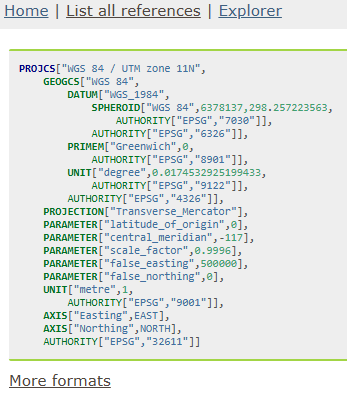
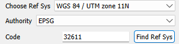

# Spatial Tools

## Georeferencer

## Reference System Information

A reference system (more commonly known as a **spatial reference system (SRS)**
or **coordinate reference system (CRS)**) defines how the pixel coordinates of
your raster image are translated into real-world coordinates.

Reference systems can be represented in several forms. Common representations
include:

### 1. WKT Strings

Example:

```text
GEOGCRS["WGS 84",
    DATUM["World Geodetic System 1984",
        ELLIPSOID["WGS 84",6378137,298.257223563,
            LENGTHUNIT["metre",1]]],
    PRIMEM["Greenwich",0,
        ANGLEUNIT["degree",0.0174532925199433]],
    CS[ellipsoidal,2],
        AXIS["latitude",north],
        AXIS["longitude",east],
    ID["EPSG",4326]]
```

### 2. PROJJSON Schemas

```json
{
  "type": "GeographicCRS",
  "name": "WGS 84",
  "datum": {
    "type": "GeodeticReferenceFrame",
    "name": "World Geodetic System 1984",
    "ellipsoid": {
      "name": "WGS 84",
      "semi_major_axis": 6378137,
      "inverse_flattening": 298.257223563
    }
  },
  "coordinate_system": {
    "subtype": "ellipsoidal",
    "axes": [
      {
        "name": "Latitude",
        "direction": "north",
        "unit": "degree"
      },
      {
        "name": "Longitude",
        "direction": "east",
        "unit": "degree"
      }
    ]
  }
}
```

### 3. Authority Identifiers

Example: `EPSG:4326`

An authority identifier consists of an authority name and an authority code.
An authority name specifies the organization that maintains a catalog of
coordinate reference systems. An authority code is used to access a specific
spatial reference system in that organization. Together, you are able to easily
access the parameters that describe a coordinate reference system without having
to specify the full WKT string or full PROJJSON schema.

The Georeferencer tool in WISER allows you to specify a coordinate reference
system by the authority name and authority code.



If you do not know your authority name or authority code but you do have the WKT
string or PROJJSON schema, then you will likely be able to find your authority
name and code combo. The example below guides you through this process.

Say you have this WKT string (found in your `.hdr` file):

```
coordinate system string = {PROJCS["UTM_Zone_11N",GEOGCS["GCS_WGS_1984",DATUM["D_WGS_1984",SPHEROID["WGS_1984",6378137.0,298.257223563]],PRIMEM["Greenwich",0.0],UNIT["Degree",0.0174532925199433]],PROJECTION["Transverse_Mercator"],PARAMETER["False_Easting",500000.0],PARAMETER["False_Northing",0.0],PARAMETER["Central_Meridian",-117.0],PARAMETER["Scale_Factor",0.9996],PARAMETER["Latitude_Of_Origin",0.0],UNIT["Meter",1.0]]}
```

You can see it references UTM Zone 11N and WGS 1984. Go to
[spatialreference.org](https://spatialreference.org/ref/) and search for
`UTM Zone 11N WGS 1984`.





If the search returns no results, try a less specific term such as
`UTM Zone 11N WGS`.



Click one of the results to verify it matches your WKT string.



Click **WKT-1 as HTML** to view the WKT string for that authority code.



Compare the WKT string at the URL with your own WKT string to confirm they
match.



Finally, enter the authority name and code (e.g. `EPSG:32611`) into WISER.



---

## Similarity Transform

The similarity transform tool allows you to do two things: rotate/scale an
image and translate an image's coordinate system.

### Translating Coordinate System

This section refers to the tool with the title 'Translate Coordinate Sys' in
the Similarity Transform Dialog window.

The way we translate the coordinate system is by changing the upper-left
coordinates of the geotransform. If you do not know what a geotransform is,
[this link](https://gdal.org/en/stable/tutorials/geotransforms_tut.html) is a
useful reference. From this link, you will see that we change GT(0) and GT(3).
This translates the geotransform for your coordinate system.

GT(0) corresponds to Lon/East and GT(3) corresponds to Lat/North. When the
'Translate Lat/North' and 'Translate Lon/East' fields are 0, the 'New Upper
Left Pixel Lat/North' field will equal GT(3) and the 'New Upper Left Pixel
Lon/East' field will equal GT(0). By entering values into the 'Translate
Lat/North' and 'Translate Lon/East' editable fields, you will change the new
upper left coordinate of your geo transform.

You can click on any pixel in the raster dataset and see the new spatial
coordinate it will have. This information is under the raster image. Note that
this feature only works with datasets that have geographic information.
