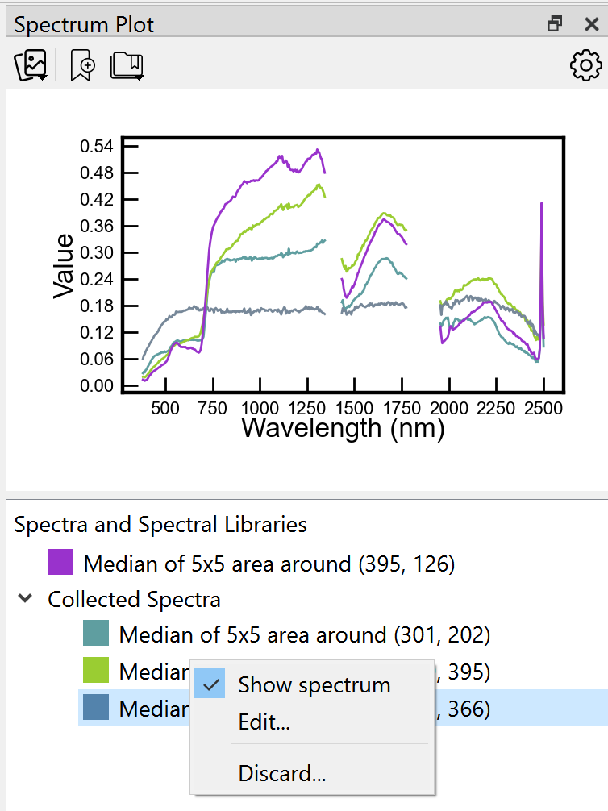
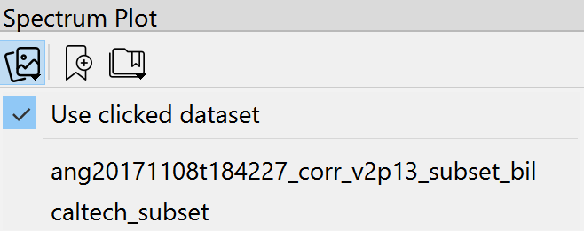
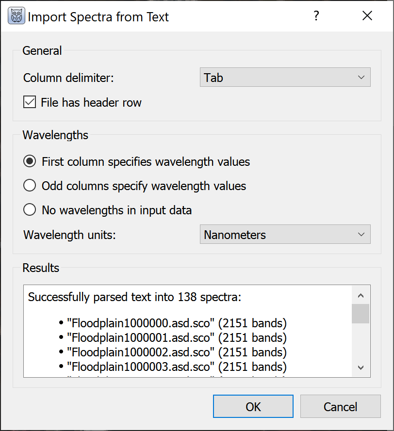
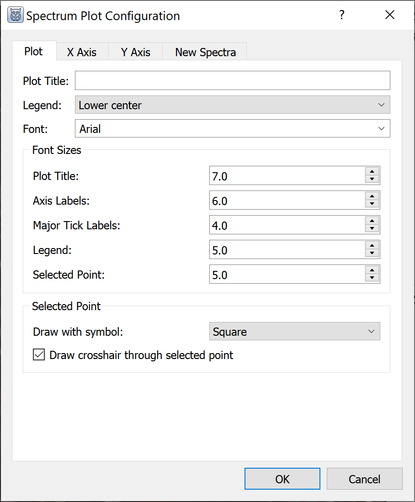

# Spectral Plots

Spectra can be viewed from any image dataset with multiple bands by clicking
points on the main and zoom windows. Choose the plot symbol on the main toolbar.
X-axis units are wavelengths if available; otherwise, units are band numbers.
Spectra can be "collected" and retained on screen or in a list, turned on and
off, and their colors changed. Clicking on the plot displays the (x, y)
coordinates of the point. Right click on the plot to hide the coordinates of
the selected point.

When multiple images are displayed in grid view, the plot will display spectra
from any dataset that the user clicks. Using the upper left icon on the plot,
the user can opt to always pull spectra from one particular dataset. This is
particularly useful with linked datasets in grid view such that clicking on one
image will display a spectrum from the same pixel in a linked image.

The import tool on the plot opens spectral libraries (.sli) and ASCII files
with spectra. For ASCII files WISER opens a dialog box to select the column
delimiter and identify which column(s) specify wavelength values.

By default, imported spectra are listed but not displayed. All spectra can be
shown or hidden by right clicking the name of the file or library in the list
below the plot, or individual spectra can be displayed by right clicking on the
spectrum name.

The spectral plot has many configuration options:

* Plot and axis titles
* Fonts and sizes
* x- and y-axis ranges
* Major and minor tick mark intervals
* Number of pixels to average for each selected point, with options for mean
  and median
* Display legend

By right clicking on plots, WISER provides an option to "Export Plot to Image."
Available formats are EPS, PDF, PNG, and SVG with 72, 100, or 300 dpi
resolution.
