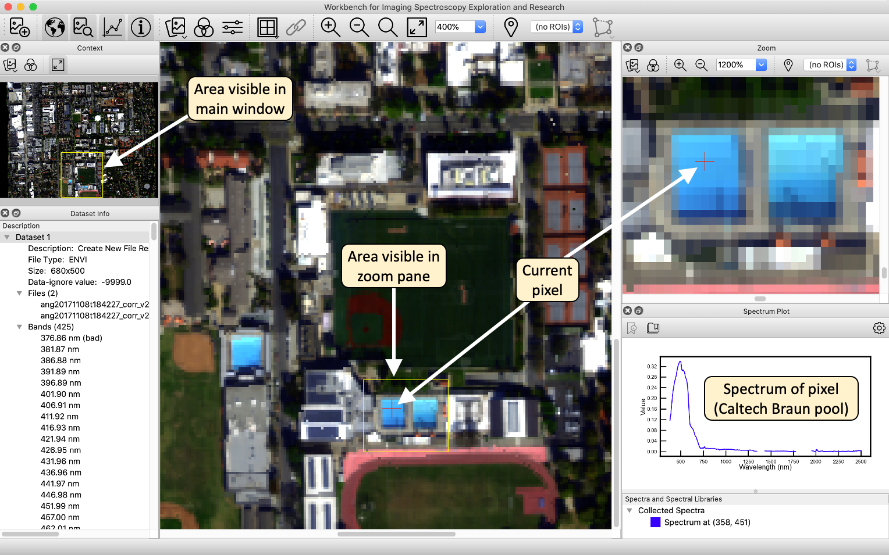

# Viewing an Image

Here is a screenshot of WISER after loading AVIRIS data of the Caltech campus
and the surrounding Pasadena area.

In this image, all of the different tools have been shown using the display
toggle buttons in the main toolbar:  the context pane, the main window and the
zoom pane, as well as the spectral plot window and the dataset information
window.
All of these components are dockable, and can be moved or resized within the
WISER user interface. They can also be undocked from the UI, so that they
appear as separate windows. Arrange WISER's user interface however you like it
best!
As the snapshot indicates, the area visible in the zoom pane is indicated in the
main window. Correspondingly, the area visible in the main window is indicated
in the context window.  _(Tip:  The color of this viewport highlight can be
changed in the WISER configuration dialog.)_  Mouse-clicks or scrolling within
the various display windows will update the other windows.
Mouse clicks within the main or zoom windows willMouse clicks within the mainpixel, and update the spectrum plot window
with the pixel's spectrum.
