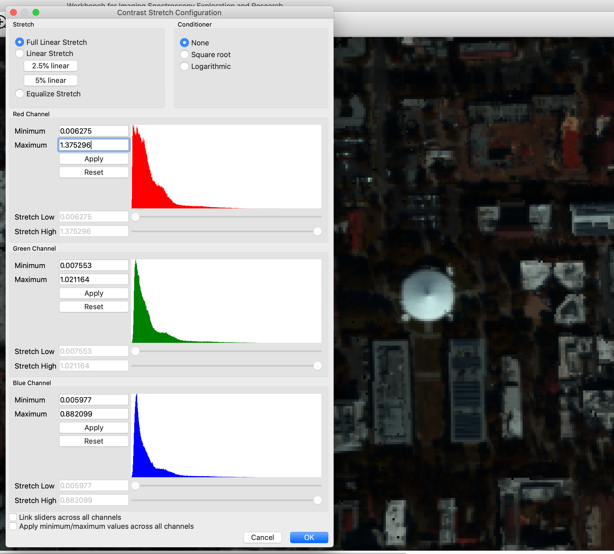
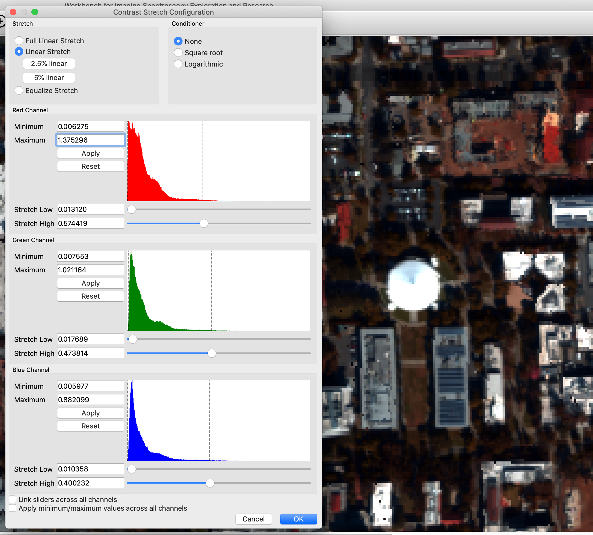
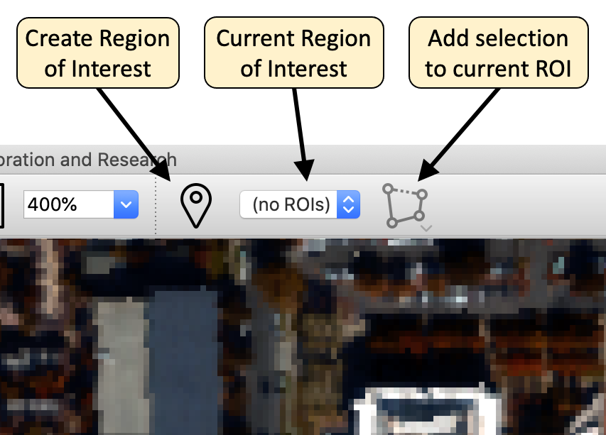
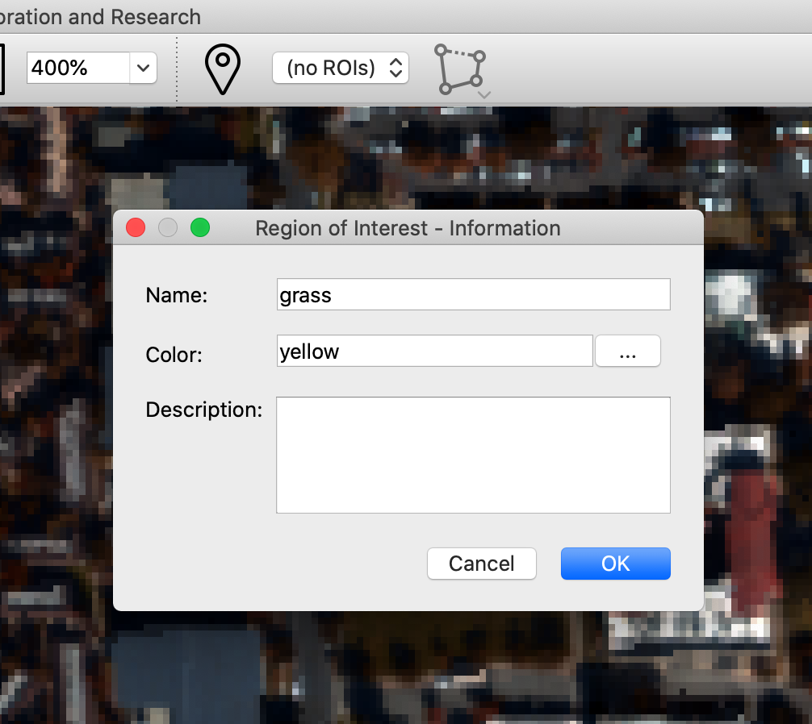
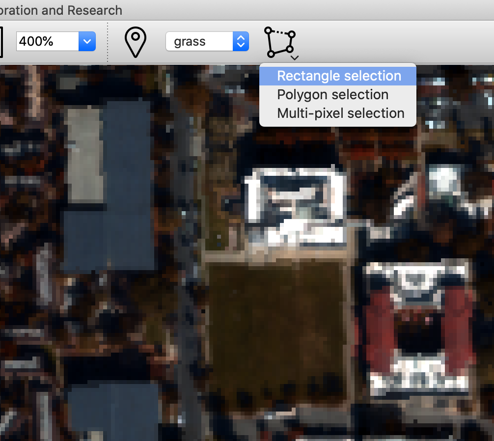
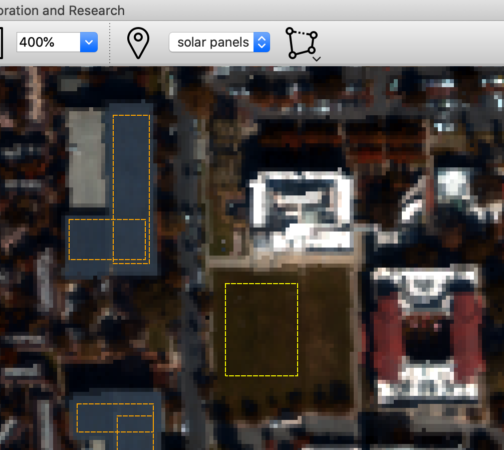
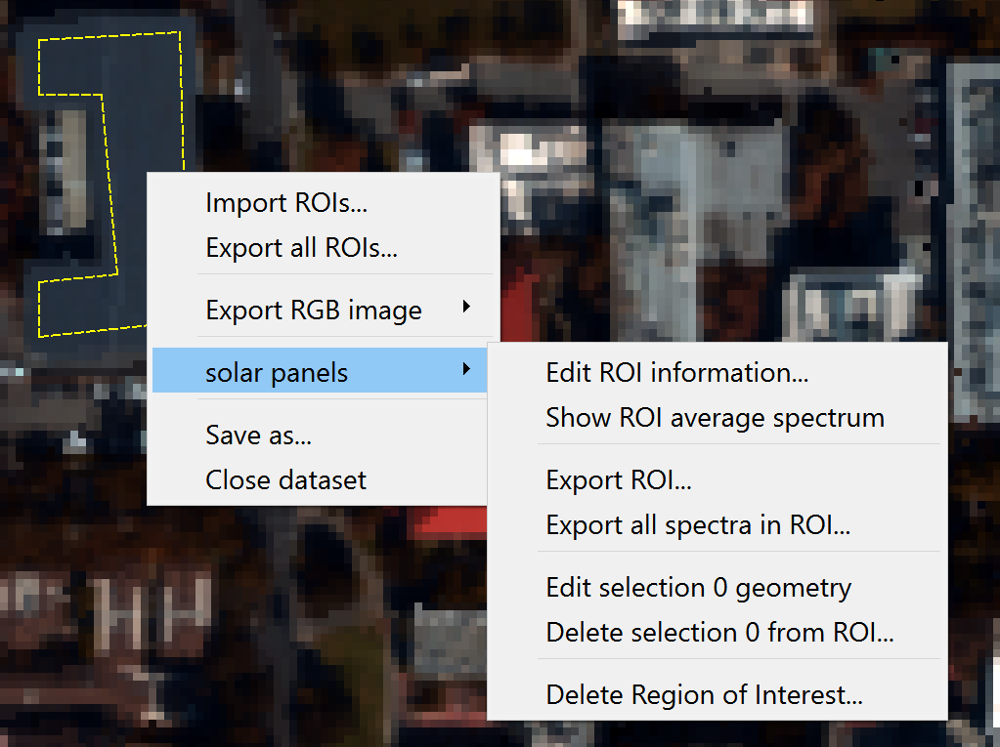
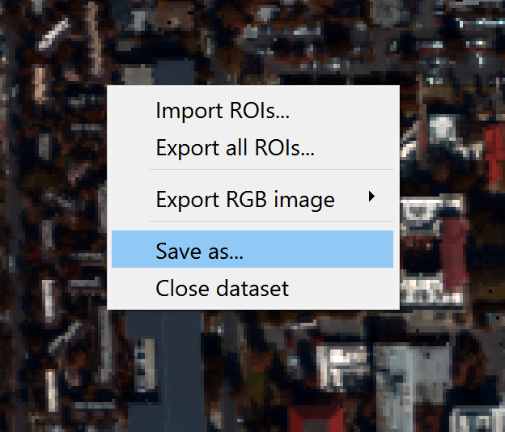
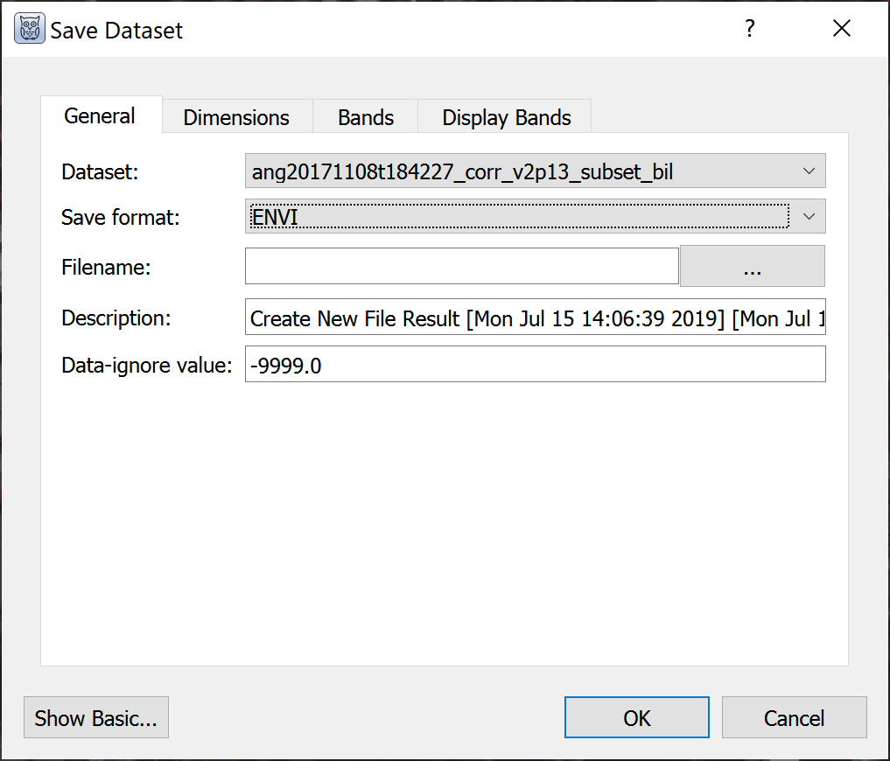

# Working with Data

(contrast-stretch)=

## Contrast Stretch

The contrast stretch tool provides sophisticated options for adjusting the
contrast of images being displayed. This allows the user to bring out details
in the image data that might otherwise not be perceptible.

Here is an example of the contrast stretch tool being used with the Caltech
AVIRIS data.

A histogram is shown for each display band, allowing one to see the
distribution of values for that band. The user can select both the kind of
contrast stretch used, and any conditioners to apply to the data before
applying the stretch. Because it is useful to see the results of applying
contrast stretch, changes in the dialog are immediately reflected in the
affected raster displays. If the "Cancel" button is pressed, the changes
will be discarded; otherwise, they will be kept when the dialog is closed.

Here is another example of applying a 2.5% linear stretch to the Caltech
AVIRIS data:

When applying a linear stretch, the sliders may be adjusted to control the
endpoints of the contrast-stretch operation. Additionally, minimum and
maximum values may be specified, to exclude noise that appears outside the
range of useful data, or to focus in on a specific range of values.

---

### How Contrast Stretch Calculations Work

WISER supports manipulating the contrast stretch of data sets being displayed.
This is often very helpful to bring out important details in the data.

Before discussing how stretch may be applied, it is important to understand what
WISER must do to display data. The band data being displayed may be of many
different data types; floating point or integer data, of various bit widths
(e.g. 8, 16, 32 or 64 bits). Therefore, the data itself may cover many
different ranges of values. The Workbench must map each band's values to an
integer color value in the range [0, 255]. If the Workbench is showing image
data in RGB mode, this must occur for each color channel; if the Workbench is
using grayscale then only one band is being used and it is mapped to a single
[0, 255] value.

Note that raster data sets may specify "data ignore values" - values that should
explicitly be ignored by tools working with the data. The Workbench filters out
such values before any of this processing occurs; they are represented as NaNs,
and all stretch calculations are implemented to ignore NaN values throughout.

Finally, note that the calculations for displaying raster data are not used
when plotting spectra; spectrum calculations use the raster data directly.

### Specifying Minimum and Maximum Limits on Band Data

The Contrast Stretch UI provides users the ability to specify minimum and
maximum limits on band data. This can be useful when raster data doesn't
specify a "data ignore value," or when raster data is computed and has a large
range of possible values, but only a small range of "useful" or "interesting"
values.

The min/max limits are applied before any histograms are computed in the
Contrast Stretch UI. Note that values outside of the min/max limits are simply
filtered out; they are not clamped to the min/max limits. This is particularly
important for N% linear stretches and histogram-equalization stretches; values
outside of the min/max limits are completely ignored in the configuration of
these stretches.

### Overview of Display Calculations

The Workbench follows this approach for displaying band data. This process is
followed for each color channel being displayed.

* The band data is normalized to either 32-bit or 64-bit floating point values
  in the range [0.0, 1.0].

  Note that this normalization _does not_ include the application of min/max
  limits; those limits are only used in the calculation of histograms in the
  Contrast Stretch UI.

  Normalized values are usually 32-bit floating point; they will only be
  64-bit floating point if the input data is also 64-bit floating point.

* Apply any user-specified conditioner to the data. Conditioners are
  discussed below, but they are functions that consume normalized data and
  produce normalized data.

* Apply any user-specified stretch to the data. Again, this mapping consumes
  normalized data and produces normalized data.

* The final floating point values are in the range [0.0, 1.0], so they are
  multiplied by 255.0 and then cast to an 8-bit unsigned integer to yield a
  color intensity.

### Stretch Types

WISER supports three stretch types:

* 100% linear stretch
* Linear stretch
* Histogram equalization stretch

If WISER is displaying an RGB image, all color channels will use the same
stretch type. It is not possible to configure WISER to display different color
channels of the same image with different stretch types.  (Obviously, the
parameters for each channel may be different, as each channel's data
distribution will be different.)

### 100% Linear Stretch

The "100% linear stretch" type causes the Workbench to follow a very
straightforward, simple mapping of band data to color values in the range
[0, 255]. The specific mapping depends on the type of the input data.

1. The minimum and maximum data value for each band is determined.

2. Values in each band are mapped to the range [0.0, 1.0] with a simple
   calculation:  (value - band_min) / (band_max - band_min). This is typically
   represented as a 32-bit floating point value, but may be 64-bit floating
   point if the initial data was 64-bit floating point.

3. Values are then scaled to integers in the range [0, 255], with 0.0 mapping
   to 0, and 1.0 mapping to 255.

This approach is called "100% linear stretch" because it is just the "linear
stretch" method, with low and high bounds taken from the band's minimum and
maximum values.

### Linear Stretch

The "linear stretch" type causes WISER to map band values in a range
[stretch_low, stretch_high] to floating-point values in the range [0.0, 1.0].

* Values less than stretch_low are mapped to 0.0.
* Values greater than stretch_high are mapped to 1.0.
* Values between stretch_low and stretch_high are linearly mapped to a value
  in the range [0.0, 1.0].

These intermediate values are then mapped to a color value in the range
[0, 255].

WISER supports arbitrary values for the stretch_low and stretch_high values,
and each color channel will specify its own values for stretch_low and
stretch_high. The Contrast Stretch UI calculates and displays a histogram of
the band data for each channel, to aid the user in selecting appropriate
stretch_low / stretch_high values. In addition, the UI provides the ability to
apply a 2.5% or 5% linear stretch across all channels.

For an N% linear stretch, WISER will choose each channel's stretch_low and
stretch_high such that (N/2)% of the low values will be excluded, and (N/2)%
of the high values will be excluded. This is computed from the band's
histogram, and is therefore approximate.  (As mentioned earlier, this histogram
is computed after the min/max limits have been used to filter the band's data.)

### Histogram Equalization Stretch

The "histogram equalization stretch" type causes WISER to map the normalized
band values to floating point values in the range [0.0, 1.0] such that the
density of the output values is uniform across this range. This is computed
from the band's histogram.  (As mentioned earlier, this histogram is computed
after the min/max limits have been used to filter the band's data.)

### Conditioners

Conditioners can be useful when the input data's distribution needs to be
modified; for example, to bring out details in low intensity values and to mute
variations in high intensity values. WISER supports three conditioner options:

* No conditioner
* Square root conditioner
* Logarithmic conditioner

All conditioners consume normalized data, and produce normalized data. In the
case of "no conditioner," this can be thought of as the identity function, but
the implementation simply does nothing.

It may be noted that sqrt(x) for x in [0.0, 1.0] already produces values only
in the range [0.0, 1.0]. This is what WISER does for square root conditioning.

In the case of logarithmic conditioner, WISER uses the function
log2(x + 1.0); when given values in the range [0.0, 1.0], this will
only produce values in the range [0.0, 1.0].

---

## Regions of Interest

WISER supports the creation of Regions of Interest (ROI) on a raster data set.
Regions of Interest may be created in both the main window and the zoom window.
Once a ROI has been created, the average spectrum over the ROI may be plotted,
and the spectra of all pixels in the ROI may be exported as an ASCII file.

Here are the Region of Interest tools in the main toolbar:

The first button allows a new Region of Interest to be created; a dialog allows
the user to enter basic details about the Region of Interest. It is recommended
to use a different color for each Region of Interest to avoid confusion.

Once a Region of Interest is created, _selections_ may be added to the ROI.
The right button allows users to create rectangle, polygon, and point-set
selections, which will then be added to the current Region of Interest. The
ROI that the selection is added to may be changed with the drop-down combobox
in the toolbar.

> Tip:  The status bar at the bottom of the UI provides instructions about how
> to create each kind of selection.

Here is the UI state after two Regions of Interest have been created - one named
"grass" and the other named "solar panels". Note that the "solar panels" ROI
is comprised of multiple overlapping rectangle selections (this could also be
done with a single polygon selection).  **It is not a problem to have
overlapping selections in a Region of Interest;** each pixel in the ROI will
only be used once by operations on the ROI.

Once a Region of Interest has been created, right-clicking in the ROI's
selections will pop up a context menu providing various operations with the ROI.

* The ROI's information or display color may be edited
* Individual selections in the ROI may be edited or deleted, or the entire
  ROI may be deleted
* The average spectrum of the ROI may be displayed in the spectrum plot
  window
* The spectra of every pixel in the ROI may be exported as an ASCII file
* Import and export ROI's as .geojson files

---

## Saving and Subsetting Datasets

There are two ways to save datasets with options for spatial and spectral
subsetting. The first is by right clicking the image and selecting "Save as..."
The second option is "Save dataset" in the file menu, selecting the image to
export.

In the dialog box, click "Show Advanced" to access the following:

* Data description
* Data ignore value
* Spatial subsetting ("Dimensions" tab)
* Choose the wavelengths to save and set bad bands
* Set default RGB or grayscale display bands

---

## Spectral Plots

Spectra can be viewed from any image dataset with multiple bands by clicking
points on the main and zoom windows. Choose the plot symbol on the main toolbar.
X-axis units are wavelengths if available; otherwise, units are band numbers.
Spectra can be "collected" and retained on screen or in a list, turned on and
off, and their colors changed. Clicking on the plot displays the (x, y)
coordinates of the point. Right click on the plot to hide the coordinates of
the selected point.

When multiple images are displayed in grid view, the plot will display spectra
from any dataset that the user clicks. Using the upper left icon on the plot,
the user can opt to always pull spectra from one particular dataset. This is
particularly useful with linked datasets in grid view such that clicking on one
image will display a spectrum from the same pixel in a linked image.

The import tool on the plot opens spectral libraries (.sli) and ASCII files
with spectra. For ASCII files WISER opens a dialog box to select the column
delimiter and identify which column(s) specify wavelength values.

By default, imported spectra are listed but not displayed. All spectra can be
shown or hidden by right clicking the name of the file or library in the list
below the plot, or individual spectra can be displayed by right clicking on the
spectrum name.

The spectral plot has many configuration options:

* Plot and axis titles
* Fonts and sizes
* x- and y-axis ranges
* Major and minor tick mark intervals
* Number of pixels to average for each selected point, with options for mean
  and median
* Display legend

By right clicking on plots, WISER provides an option to "Export Plot to Image."
Available formats are EPS, PDF, PNG, and SVG with 72, 100, or 300 dpi
resolution.
