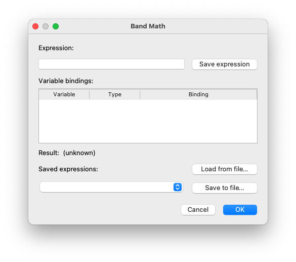
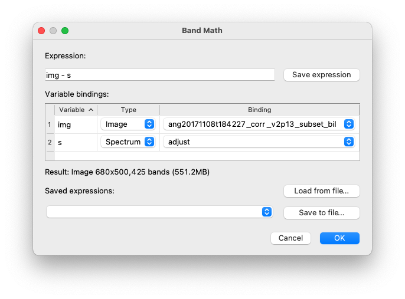

Band-Math
=========

WISER supports the evaluation and visualization of simple band-math expressions
that generate image-cubes, image-bands, and spectra.  The band-math
functionality is accessed under the "Tools" menu in the application menubar.
This will cause the band-math dialog to be displayed to the user:

Using the Band-Math Dialog
--------------------------

Enter the band-math expression into the "Expression" field.  When this field
loses focus (e.g. the user tabs away from the field), the expression will be
parsed, and all variables in the expression are listed in the "Variable
bindings" table.  This allows the user to specify the type and value associated
with each variable in the expression.

WISER will also analyze the expression to identify any potential issues in the
expression and bindings as specified (e.g. a size mismatch between two values),
and if no issues are identified, WISER will estimate the total size of the
result in bytes.

Here is an example after a simple expression has been entered and analyzed:

Once the expression and bindings have been specified, the user may click the
"OK" button to cause the band-math expression to be evaluated, and the result
to be displayed in the WISER user interface.

Band-Math Expressions
---------------------

Valid band-math expressions can include:

*   Literal values:  numbers, strings (using either single-quotes or
    double-quotes) or Boolean values ``true`` and ``false`` (case-insensitive).
    Numbers may be used just about anywhere in expressions.  Strings and Boolean
    values cannot be used in arithmetic expressions, but may be useful where
    functions have extra arguments to control details of how the function works.

*   Variables:  Names must start with an alphabetical character, and can include
    any alphanumeric character or underscore.  Note that variable names are
    case-insensitive; WISER always converts them to lowercase internally.  For
    example, both "img" and "IMG" are the same variable, and WISER will use
    "img" in the variable-bindings table.

*   Binary arithmetic operations:  ``a + b`` (addition), ``a - b`` (subtraction),
    ``a * b`` (multiplication), ``a / b`` (division).

*   Power/root operations:  ``a ** b`` raises ``a`` to the ``b``-th power.  If
    ``b`` is less than 1, this will compute a root.

*   Unary negation:  ``-a``.

*   Function calls:  ``f(a)``.  Function names follow the same naming rules as
    variable names.  Note that function names are case-insensitive; WISER always
    converts them to lowercase internally.

*   Comparison operations:  ``a _op_ b`` where ``_op_`` is ``==``, ``!=``, ``>``,
    ``<``, ``>=``, or ``<=``.

Operator precedence follows the usual rules.  Users can force a different
evaluation order with parentheses.

Arithmetic on Images, Bands and Spectra
---------------------------------------

WISER supports band-math expression that mix and match image cubes, image bands,
spectra, and numbers.  In general, these operations are performed element-wise
across the operands.

The simplest case is if one operand is an image cube, band or spectrum, and the
other operand is a number.  In this case, the operation will be performed
between every element and the number that was specified.

If two operands are the same type and dimensions, the operation is generally
straightforward.  For example, in an expression ``img1 + img2`` where ``img1``
and ``img2`` have the same spatial and spectral dimensions, the result will be
the sum of every pair of values in ``img1`` and ``img2``, across all pixels and
bands.

If two operands are not of the same type, but are of "compatible" types, then
one operand will be _broadcast_ across the other operand in a way that makes
sense for band-math expressions.  For example, in an expression ``img + band``
where ``img`` is an image cube, and ``band`` is an image band, and ``img`` and
``band`` have the same spatial dimensions, the result will be computed by adding
``band`` to every band in ``img``.

Similarly, in an expression ``img + spec`` where ``img`` is an image cube, and
``spec`` is a spectrum, and ``img`` and ``spec`` have the same number of bands,
the result will be computed by adding ``spec`` to every pixel in ``img``.

Image bands and spectra are not compatible when used with binary operations, and
WISER will report an error when this situation occurs.

.. note::
    For more information on the concept of broadcasting, see the NumPy
    documentation on broadcasting:

    *   `Array Broadcasting in NumPy <https://numpy.org/doc/stable/user/theory.broadcasting.html>`_
    *   `Broadcasting <https://numpy.org/doc/stable/user/basics.broadcasting.html>`_

Comparisons
-----------

Comparison operations work in the same way as the arithmetic operations work.
The main detail here is that comparisons always generate a result whose elements
are 8-bit integers (i.e. bytes); a value of 0 represents "false," and a value of
1 represents "true."  This can be used to mask values very easily.  For example,
an expression ``img1 * (map == 3)`` would include all pixels from ``img1``
where the corresponding pixel in ``map`` has a value of 3.

Variable Types and Bindings
---------------------------

To simplify the entry of variable bindings, WISER infers the type of a variable
from its name:

*   Any variable name starting with ``i`` is initially assumed to be an image
    cube
*   Any variable name starting with ``s`` is initially assumed to be a spectrum
*   Any other variable name is initially assumed to be an image band

The type of a variable can be altered in the user interface.

Based on the type of the variable, WISER provides a mechanism for the user to
select a value to bind the variable to.

Band-Math Functions
-------------------

Functions allow very sophisticated operations to be integrated into the WISER
band-math functionality.  Functions may take any number of arguments (including
zero), and must produce a single result.  The arguments and result can be image
cubes, bands, spectra, numbers, strings, or Boolean values.  As one would
expect, a function's arguments may themselves be expressions and/or other
function calls.
